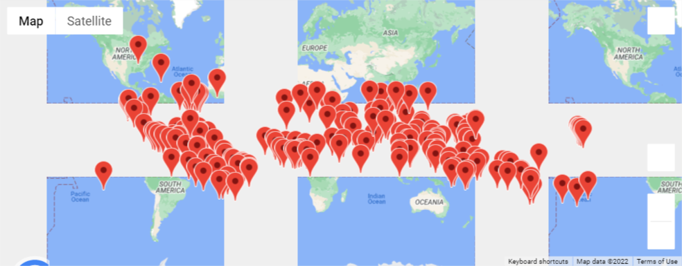
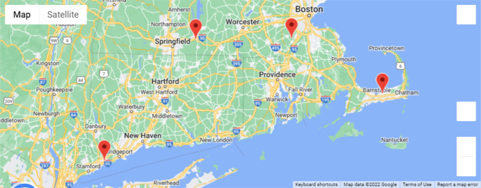

# World_Weather_Analysis

This project focused on usage of the gmaps API. Based on weather criteria, four cities were selected out of two thousand randomly generated entries. Maps are displayed with a driving overlay between cities, as well as accommodations information for each stop. Requires a google API key to run. 

